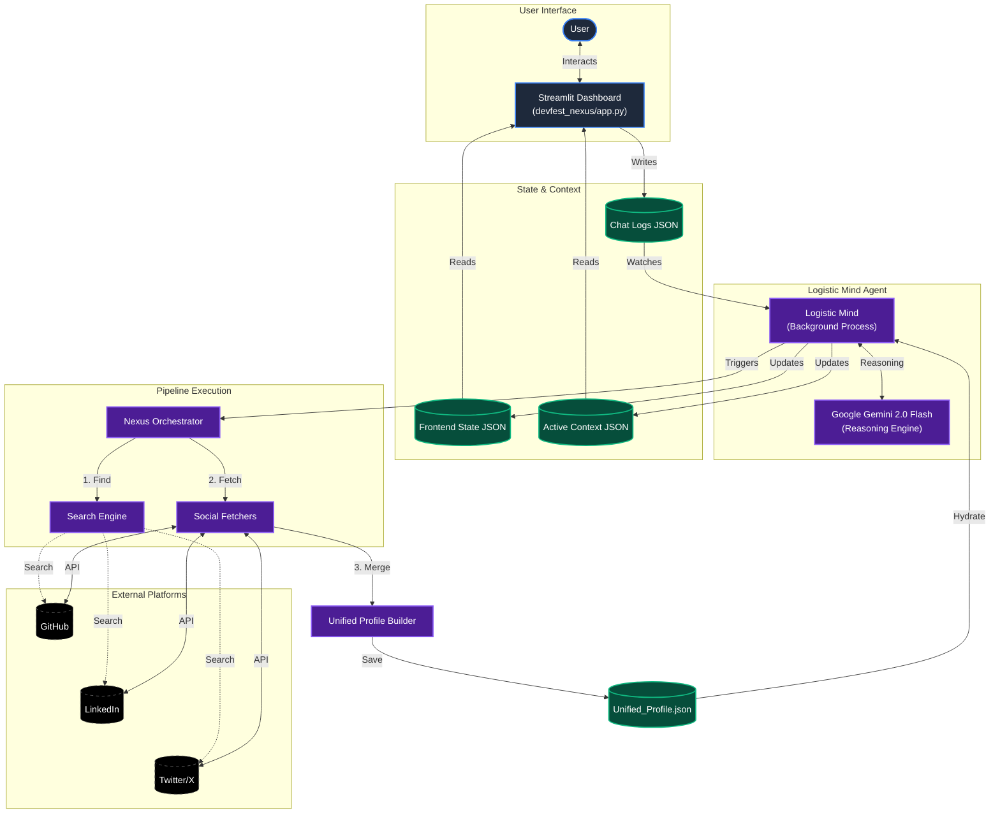
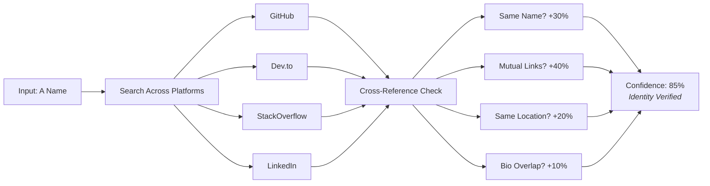
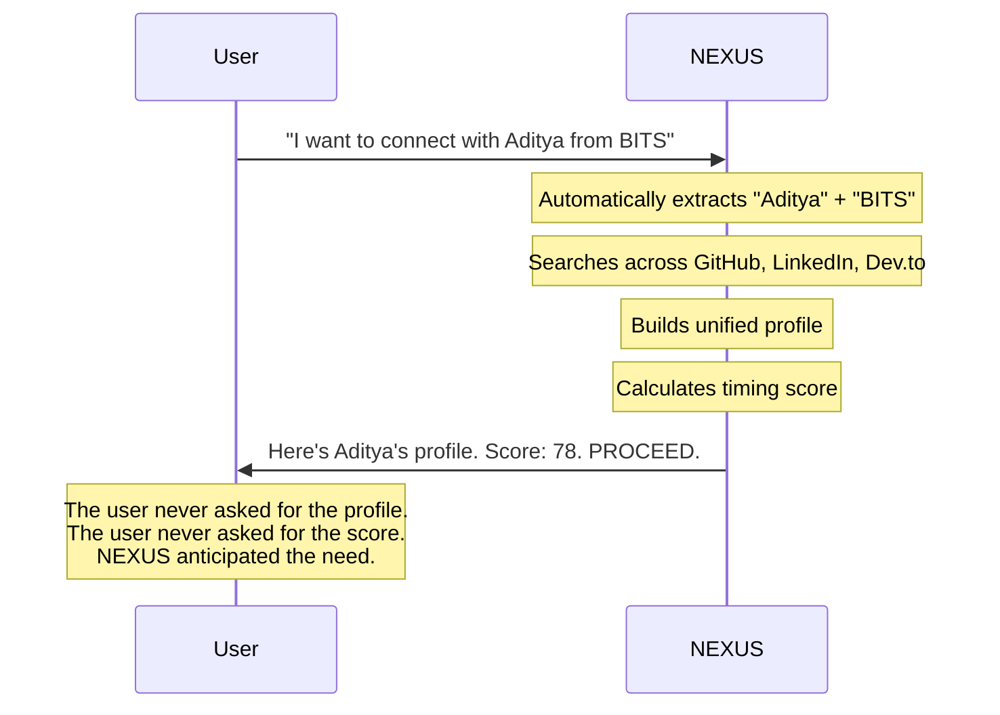

  
   
  
  
  

 
  
  
  
  
  
  
  
  
  

  <strong><a href="#the-pitch">THE PITCH</a></strong>
  &nbsp;&nbsp;|&nbsp;&nbsp;
  <strong><a href="#the-technical-depth--architecture-and-functioning">TECHNICAL DEPTH</a></strong>
  &nbsp;&nbsp;|&nbsp;&nbsp;
  <strong><a href="#demo-operations--see-nexus-in-operation">DEMO OPERATIONS</a></strong>

---
# THE TECHNICAL DEPTH : ARCHITECTURE AND FUNCTIONING

NEXUS operates as a dual-process system: a **Streamlit UI** for the strategy console and a **Background Agent (Logistic Mind)** for autonomous intelligence.

---

### 3. Identity Confidence Scoring — Verified Profiles

How does one confirm "John Smith on GitHub" is the same "John Smith on LinkedIn"?

**NEXUS verifies it.**

 

> The system does not just scrape. It **validates**. If data does not align across platforms, a lower confidence score appears — indicating how much to trust the profile.

 

---

### 4. Psychological Timing — Reading Digital Body Language

 

|   Activity Observed   |           Psychological State           |  System Response  |
| :-------------------: | :-------------------------------------: | :---------------: |
|    Coding at 2 AM     | Flow State — focused, open to tech talk | **+15 to score**  |
| Just shipped a launch |        Ego High — inbox flooded         | **Wait 72 hours** |
|      Friday 6 PM      |   Dead Zone — checked out for weekend   | **-40 to score**  |
|     Tuesday 3 PM      |  Dopamine Window — open to serendipity  | **+10 to score**  |
|  Ranting on Twitter   |        High Cortisol — defensive        |     **ABORT**     |

 

> The engine does not just check "last active 2 hours ago." It interprets **what that activity means psychologically**.

 

---

### 5. Proactive AI — Action Before Request

Most AI tools wait for explicit requests.

**NEXUS anticipates.**

 

 

> A name mentioned in conversation triggers a full dossier. No buttons. No manual lookup. **True agent behavior.**

 

---

# DEMO OPERATIONS : SEE NEXUS IN OPERATION 

> **📌 Note on Data Sources:**
> 
> Some platform data is **simulated** in this demo due to API restrictions:
> - **LinkedIn**: Scraping violates Terms of Service
> - **Twitter/X**: API access requires paid enterprise subscription
> - **GitHub**: Fully functional with live API
>
> For platforms where live data isn't accessible, we use GitHub profile data to simulate corresponding LinkedIn/Twitter information. This demonstrates that **multi-source data compilation and identity verification works as designed**.
>
> In a production deployment with funding, paid API access would enable full real-time data retrieval across all platforms. 

  
   
  
   
  
  
  
  
  
  
  
  
 

---

  
  
  
  
  

