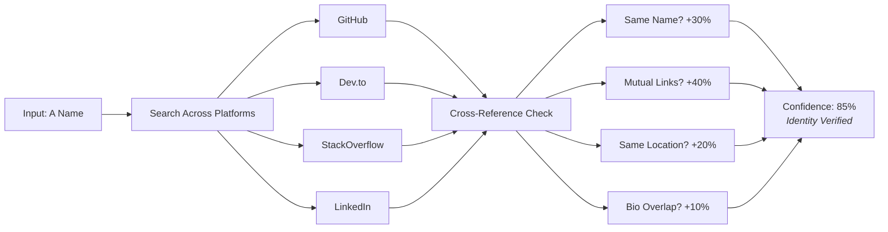
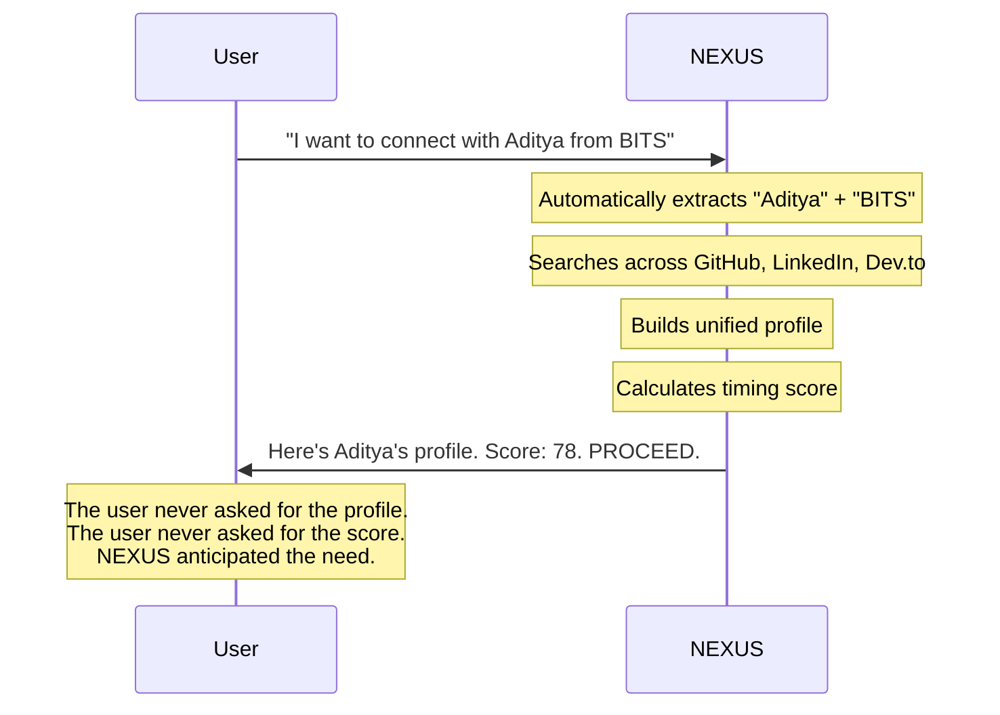

<p align="center">
  
</p>

<h2 align="center">The Networking Tool That Tells You When <em>Not</em> To Reach Out</h2>

<p align="center">
  
  
  
</p>

---

<br/>

## The Insight

**Every networking tool answers:** *"Who should I connect with?"*

**Nobody answers:**
- **WHEN** is the right moment to reach out?
- **WHY** would they respond to *me* specifically?
- **HOW** should I approach based on their current mental state?

<br/>

<p align="center">
  <strong>LinkedIn is a phonebook.</strong><br/>
  <strong>NEXUS is a strategist.</strong>
</p>

<br/>

---

## What NEXUS Does

<br/>

### 1. Three AI Advisors — Not One Generic Chatbot

Users select their context. Advice adapts accordingly.

<table align="center">
<tr>
<td align="center" width="33%">
<h3>Student</h3>
<em>Internships & Mentorship</em>
<br/><br/>
Alumni Networks<br/>
Recruiters<br/>
Career Mentors
</td>
<td align="center" width="33%">
<h3>Founder</h3>
<em>Funding & Talent</em>
<br/><br/>
Venture Capital<br/>
Co-founder Matching<br/>
Key Hires
</td>
<td align="center" width="33%">
<h3>Researcher</h3>
<em>Labs & Collaboration</em>
<br/><br/>
Lab Opportunities<br/>
Citation Networks<br/>
Conference Circles
</td>
</tr>
</table>

<br/>

> Each mode runs **different scoring algorithms**. Students receive alumni-weighted advice. Founders get signal-weighted intelligence. The AI speaks the user's language.

<br/>

---

### 2. Timing Intelligence — The System Tells You to WAIT

Other tools: *"Here's the profile. Good luck."*

NEXUS: *"Hold off. They just launched a product. Inbox is flooded. Try again in 72 hours."*

<br/>

<table align="center">
<tr>
<th>Score</th>
<th>Verdict</th>
<th>What It Means</th>
</tr>
<tr>
<td align="center">90-100</td>
<td><strong>GO NOW</strong></td>
<td>Perfect window. Act immediately.</td>
</tr>
<tr>
<td align="center">75-89</td>
<td><strong>PROCEED</strong></td>
<td>Good timing. Draft carefully.</td>
</tr>
<tr>
<td align="center">55-74</td>
<td><strong>CAUTION</strong></td>
<td>Bad timing. Nurture first.</td>
</tr>
<tr>
<td align="center">0-54</td>
<td><strong>ABORT</strong></td>
<td>Door is shut. Wait for a signal change.</td>
</tr>
</table>

<br/>

> NEXUS is the only tool that advises users **NOT** to act. That is the feature.

<br/>

---

### 3. Identity Confidence Scoring — Verified Profiles

How does one confirm "John Smith on GitHub" is the same "John Smith on LinkedIn"?

**NEXUS verifies it.**



<br/>

> The system does not just scrape. It **validates**. If data does not align across platforms, a lower confidence score appears — indicating how much to trust the profile.

<br/>

---

### 4. Psychological Timing — Reading Digital Body Language

<br/>

| Activity Observed | Psychological State | System Response |
|:-----------------:|:-------------------:|:---------------:|
| Coding at 2 AM | Flow State — focused, open to tech talk | **+15 to score** |
| Just shipped a launch | Ego High — inbox flooded | **Wait 72 hours** |
| Friday 6 PM | Dead Zone — checked out for weekend | **-40 to score** |
| Tuesday 3 PM | Dopamine Window — open to serendipity | **+10 to score** |
| Ranting on Twitter | High Cortisol — defensive | **ABORT** |

<br/>

> The engine does not just check "last active 2 hours ago." It interprets **what that activity means psychologically**.

<br/>

---

### 5. Proactive AI — Action Before Request

Most AI tools wait for explicit requests.

**NEXUS anticipates.**

<br/>



<br/>

> A name mentioned in conversation triggers a full dossier. No buttons. No manual lookup. **True agent behavior.**

<br/>

---

## The Demo

```
User: "I need to reach out to someone at Bain for consulting advice"

NEXUS: "Got it. What's your background — business, tech, or something else?"

User: "CS student at BITS"

NEXUS: "Smart angle: BITS has strong consulting alumni. 3 BITS alumni 
        currently at Bain identified. Best timing opportunity:
        
        → Priya Sharma (Associate, Mumbai)
        → Last active: 6 hours ago on LinkedIn
        → Score: 87 (PROCEED)
        → She just posted about mentoring students. Perfect timing.
        
        Should I help draft your message?"
```

<br/>

---

## Built With

<p align="center">
  
  
  
  
</p>

<br/>

---

## Team Error404

<table align="center">
<tr>
<td align="center"><strong>Aditya Kushwaha</strong><br/><em>Backend & Scoring</em></td>
<td align="center"><strong>Aditya Melinkeri</strong><br/><em>AI & Prompts</em></td>
<td align="center"><strong>Aksh Shah</strong><br/><em>Data Pipeline</em></td>
<td align="center"><strong>Bhuvanesh</strong><br/><em>Frontend & UX</em></td>
</tr>
</table>

<br/>

---

<br/>

<h3 align="center">Other tools show profiles.</h3>
<h2 align="center">NEXUS tells you when NOT to use them.</h2>

<br/>

<p align="center">
  <em>DevFest 5.0 | BITS Pilani Goa | January 2026</em>
</p>
